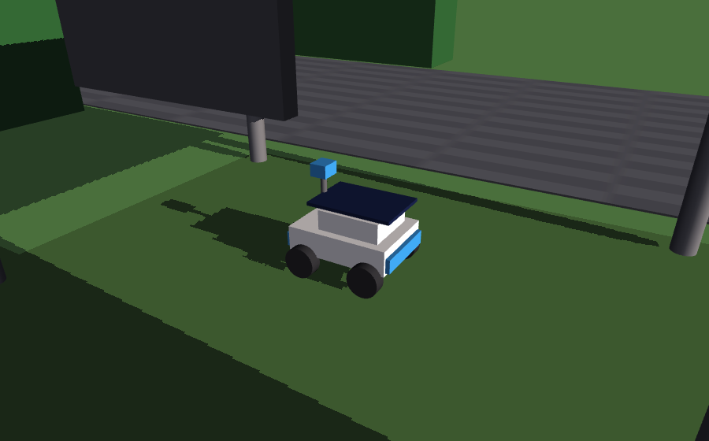
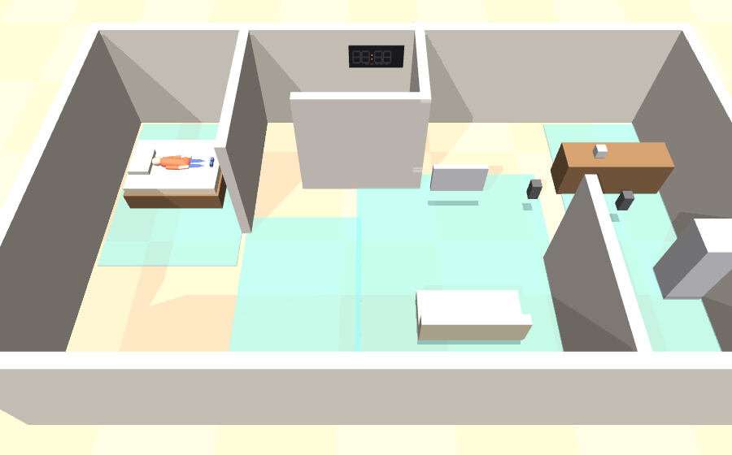
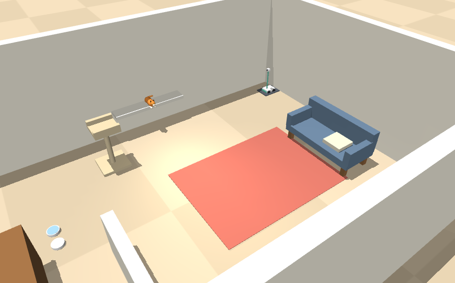
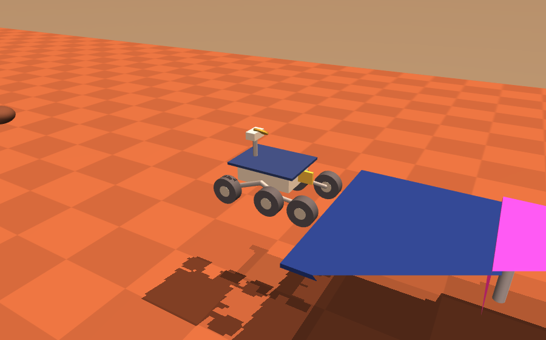
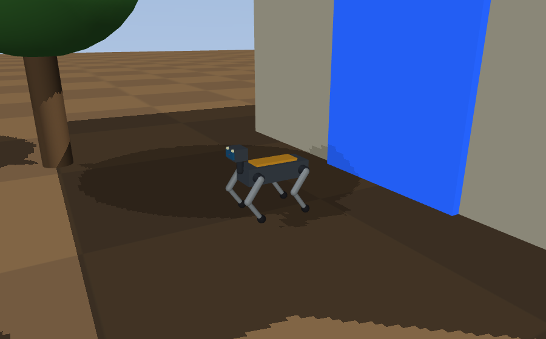
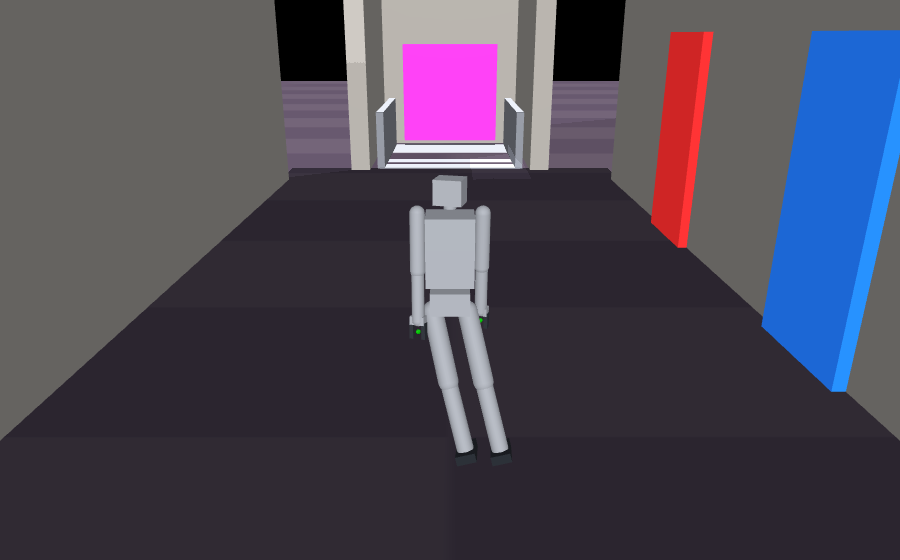

# Pyunto Robotics

Message a robot from the Pyunto mobile app, and watch it act.

[**Pyunto for iPhone and iPad**](https://apps.apple.com/app/id6755097890) ·
[**Pyunto for Android**](https://play.google.com/store/apps/details?id=com.pyunto.app)

```bash
pip install 'pyunto-robotics[llm] @ git+https://github.com/utagoeinc/pyunto-robotics'
pyunto-robotics showqr
```

Scan the square that appears with the Pyunto app. A window opens on a robot parked in a
carport with a solar panel on its back; write "go and find some sunlight, and bring back
power" in the diary on your phone, and it drives out, finds sunlight by measuring what the panel
receives, charges, comes home, and turns the house lights on with what it collected.

The robot runs on **your** computer. Pyunto never sees the room, the camera, or anything the
robot does — the diary is end-to-end encrypted, and decryption happens on your machine.

---

## Quick start

Three commands, and the only thing to remember is the first one.

```bash
pip install 'pyunto-robotics[llm] @ git+https://github.com/utagoeinc/pyunto-robotics'
python -m pyunto_robotics.download_model   # so the robot reads what you write (~5.5 GB, once)
pyunto-robotics showqr                     # a square appears in the terminal
```

Not on PyPI yet, so the install comes from git — one command either way. It brings
`pyunto-agent` with it.

Scan that square with the Pyunto app. The app asks which diary to let the robot into and shows
who runs it; when you approve, **the robot opens by itself** — no second command, nothing to
copy back into the terminal.

```
waiting for the scan… (Ctrl-C to stop)
paired — opening the robot.

listening — message the robot from the Pyunto app. Ctrl-C to stop.
```

Then write in the diary, in your own words:

```
go and find some sunlight, and bring back power
```

The robot says how it understood you, drives out, finds the sun by measuring, charges, comes
home, and turns the house lights on — reporting each step in the same thread.

Open that space in the app once after pairing. The diary is end-to-end encrypted, so a member
has to hand the robot a key; the server cannot do it alone.

### Choosing a robot

```bash
pyunto-robotics robots                  # what is installed
pyunto-robotics showqr --robot pet      # pair and open a particular one
pyunto-robotics demo --robot watch      # if already paired
pyunto-robotics whoami                  # this robot's account and its spaces
```

---

## The robots

Six machines and six worlds ship with the package. Every picture below is the scene as it
opens, rendered from the simulator itself.

### `solar` — fetches its own energy



The demonstration the SDK leads with, and the only one where the robot finds something by
measuring rather than by being told where it is. It drives out, reads what the panel is
receiving as it goes, stops when the measurement says it is in sunlight, charges, comes home,
and turns the house lights on with what it collected.

> *"go and find some sunlight, and bring back power"*
> *"I think we're running low on power"*
> *"how much charge have you got?"*

### `watch` — a house that watches, with no robot in it



There is no machine to command here. The flat itself watches an older person living alone —
floor sensors in each room, a bed sensor, temperature and humidity, the lock, the doorphone —
and writes what it sees into a diary a family member reads from another city.

**No cameras indoors.** The person being watched did not ask to be; the only camera is the
doorphone, and it faces the street. It also turns out to be the better sensor: three
unanswered callers on a day she did not get up is corroboration a motion sensor cannot give.

> *"how is she doing?"*
> *"what has she done today?"*
> *"has anyone been to the door?"*
> *"it feels stuffy in there, can you do something?"*

### `pet` — a camera that has to aim, not just drive



The opposite case, and the one that shows why the flat above has no camera. Here the only
human is the one holding the phone, in their own home, looking for their own cat — so a camera
is the right instrument, and the demo is about aiming it.

The cat's four usual places are at four different heights: under the sofa, the windowsill, the
cat tree, the top of the bookshelf. A fixed forward-facing lens finds none of them.

> *"where is the cat?"*
> *"have you seen her anywhere?"*
> *"look around the flat"*
> *"point the camera upwards a bit"*

### `mars` — driving by camera alone



The clearest demonstration of mapless navigation: there is no map of Mars in the robot, and
the targets are found by looking. Six wheels, a camera mast, and a channel to follow.

> *"drive to the sample"*
> *"head over to that rock"*
> *"how steep is the ground?"*

### `orchard` — four legs and a load



Walks the rows on four legs and carries a crate. Where the wheeled robots need a surface, this
one handles the ground an orchard actually has.

> *"fetch the crate of apples"*
> *"take them to the shed"*
> *"what are you carrying?"*

### `hotel` — cleans rooms and rides the lift



Two floors, guest rooms, and a lift the robot has to call, board and ride. The multi-storey
case: getting somewhere is a task in itself, not just a drive.

> *"clean the rooms on both floors"*
> *"clean this corridor"*
> *"which floor are you on?"*

---

## Writing in your own words

There are no commands to learn. Write what you mean, and a local language model reads it:

```
"I think we're running low on power"           ->  find_sun -> goto(park)
"have you seen the cat anywhere?"              ->  patrol
"point the camera upwards a bit"               ->  tilt
"it feels stuffy in there"                     ->  temperature
"the guests have checked out, sort the rooms"  ->  clean
```

None of those are in any list, and that is the point: a keyword table only matches the
phrasings somebody thought to write down, and every miss needs another pattern, in every
language the product ships in. There is no end to that table.

The model runs on your machine, so the diary is never sent anywhere to be understood. This is
the default and needs no flag — run `python -m pyunto_robotics.download_model` once.

It needs Apple silicon. Everywhere else, and until that download has run, the robot matches
commands instead and says so in one line at startup rather than refusing to open.

---

## Command mode

Some sites want the opposite: a closed vocabulary. Equipment with its own command set, an
operator who types the same six instructions all day, a safety case that will not accept a
model deciding what was meant.

```bash
pyunto-robotics demo --robot pet --commands mysite.json
```

```json
{
  "verbs": {
    "find":  ["FIND-TGT", "locate the animal"],
    "photo": ["CAM-SNAP"],
    "home":  ["RTB", "return to base"]
  },
  "objects": {
    "sill": ["POS-03"]
  }
}
```

Only the actions you name are overridden — everything else keeps its built-in phrasings, so
you change the two verbs your equipment spells differently and inherit the rest. Matching is
case-insensitive, so write codes the way your manual writes them. An action the robot does
not have is refused at startup, naming what it does have, rather than becoming a command that
can never fire.

`--command-mode` on its own uses the built-in lists without the model. A runnable example is
in [`examples/commands.example.json`](examples/commands.example.json).

---

## What the robot tells you

A robot that accepts an instruction, goes quiet, and posts one sentence a minute later is
indistinguishable from a robot that has crashed. So it narrates, in the same thread the
instruction arrived in.

Write "where is the cat?" and the diary fills in as it happens:

```
🤖 Understood: “where is the cat?”
   I will: find
✅ find — 🐱 She is the sunny windowsill. I have the camera on her.
[a photograph from the robot's own camera]
```

Three things are worth noticing.

The plan arrives **before the robot moves**, so a misunderstanding is caught in the two
seconds before it walks off, not after. Each step reports **as it finishes**, with ⚠️ rather
than ✅ when it did not work and a plain sentence saying why. And the picture at the end is
the robot's own camera, so a claim that a door is open comes with the evidence.

An instruction the robot cannot parse is answered too, rather than ignored:

```
🤖 I did not understand “make me a coffee”.
   I know how to: check, find, go, home, look, pan, patrol, photo, tilt…
```

This is the most common outcome of all, and the one where silence does the most damage.

Each robot answers in its own vocabulary — asking the pet camera to raise its hand gets the
list above, not a shrug. A few that people try first:

| You write | The robot does |
|---|---|
| "where is the cat?" (`pet`) | drives the flat, aims the camera at each of her places, reports where she is |
| "look up" (`pet`) | tilts the lens up without moving the robot |
| "how is she doing?" (`watch`) | reads the sensors and says where she is and whether she is up |
| "has anyone been to the door?" (`watch`) | the day's doorphone callers, and whether she answered |

Add `--no-photos` to report in words only.

---


## Bringing your own robot

The SDK is not six robots; it is a way to attach *any* robot to a diary. One class, one method:

```python
from pyunto_robotics.api import SkillResult

class MyRobot:
    def run(self, action, argument=None, where=None, expect=None) -> SkillResult:
        if action == "goto":
            ok = my_control_stack.move_to(argument)
            return SkillResult(ok, f"I went to {argument}." if ok
                                   else f"I could not reach {argument}.")
        return SkillResult(False, f"I do not know how to '{action}' yet.")
```

That is the whole contract. You get the encrypted transport, space membership, message
handling, planning and replies; you write what your machine does. It works for real hardware,
for another simulator (Newton, Isaac, Gazebo), or for a robot that is only an HTTP API.

A runnable version is in [`examples/my_robot.py`](examples/my_robot.py) — about forty lines.
The full contract, including the optional `RobotBody` interface for reusing our navigation and
door-opening skills on your own machine, is documented in
[`pyunto_robotics/api.py`](pyunto_robotics/api.py).

To ship your robot as a package others can install, declare an entry point:

```toml
[project.entry-points."pyunto_robotics.robots"]
acme = "acme_robot:setup"
```

After `pip install acme-robot`, `pyunto-robotics demo --robot acme` works with no change here.

---

## Requirements

- macOS on Apple silicon (Windows and Linux are not verified yet)
- Python 3.11 or newer — but not 3.13+ if you want the language model, which `mlx-vlm` does
  not build for yet
- The Pyunto app, and a premium space to invite the robot into

The simulator window is owned by `mjpython` on macOS; `pyunto-robotics` re-executes itself under
it automatically, so the command above works as typed.

### Installing

Neither package is published to PyPI yet, so both come from git:

```bash
pip install 'pyunto-robotics[llm] @ git+https://github.com/utagoeinc/pyunto-robotics'
```

The `[llm]` extra is what lets the robot read sentences rather than match commands, and it
installs nothing at all off Apple silicon, so the same line is safe everywhere. Drop it if you
only ever want [command mode](#command-mode):

```bash
pip install 'pyunto-robotics @ git+https://github.com/utagoeinc/pyunto-robotics'
```

To work on the SDK itself, clone it and install in place:

```bash
git clone https://github.com/utagoeinc/pyunto-robotics
cd pyunto-robotics
python3 -m venv .venv && .venv/bin/pip install -e '.[llm,dev]'
```

---

## What is private, and what is not

- Diary entries are end-to-end encrypted. They are decrypted **on the computer running the
  robot** and nowhere else. Pyunto's servers cannot read them.
- Whoever controls that computer can read everything written in that space. The app says so
  when you invite a robot, and again in the diary where every member can see it.
- The robot only ever reads the spaces it was invited to.
- Its account and keys live in `~/.pyunto-robot`. Delete that and it becomes a different robot,
  and has to be invited again.

## Licence

The Pyunto robots, scenes and SDK code are ours. MuJoCo (Apache-2.0) is a dependency.
